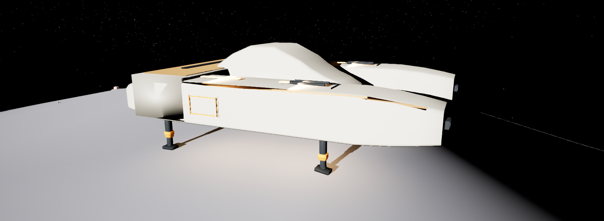

# 飞船真实地形着陆

起落流程已更新为包络边界触发、支架展开与下降并行；最新设计、参数和验证见 [贴地飞行与起落](SpacecraftSurfaceFlight.md)。

## 设计依据与边界

Elite Dangerous 的[官方 Horizons 指南](https://d1wv0x2frmpnh.cloudfront.net/elite/website/assets/English-PlayersGuide_v2.00-Horizons.pdf)把地面是否足以支撑整个起落架占地范围列为降落条件。Star Citizen 的[官方开发月报](https://robertsspaceindustries.com/en/comm-link/transmission/16043-Monthly-Studio-Report-July-2017)介绍了起落架弹簧和压缩机构用于缓冲触地、适应不平地面。

本项目据此设计有限容错的四脚支撑和辅助着陆。下面的算法是本项目实现，不代表上述游戏公开了相同的内部算法。

目的：起飞后可在真实星球 Mesh 上选择合适地面降落，不依赖人工划定 LandingSite。

职责：`UJTSSpacecraftLandingSupportComponent` 只负责支架几何、足垫接地、稳定性和附近落点搜索；飞行组件负责运动，表现组件负责收放和支架姿态，LandingManager 保留首次到达及玩家出生流程。

依赖：PlanetAnchor 的真实 Mesh 查询、飞船完整机身净空查询、Blueprint 配置的足垫平面和支架行程。没有月球专用坐标或资产路径写入 Runtime C++。

## 支撑判定

1. 保留飞船当前航向，在真实地面上采样各个展开足垫的位置，拟合支撑平面。
2. 平面相对星球径向重力的坡度须在允许范围内；为每根支架求允许高度区间，四根支架的区间必须有交集。不会通过整体抬高机身掩盖某根腿悬空。
3. 每个足垫检查九个点：中心、四个边中点、四个角。检查足垫下方完整接地面、平整度、法线变化、足垫关节倾角以及独立压缩/伸长行程。裂缝、悬崖边和局部尖峰不能只凭中心射线通过。
4. 按真实重力将接地点和 Blueprint 配置的重心投影到同一平面，构建凸支撑多边形。重心须在多边形内，并与每条边保持安全余量。
5. 机身完整可见范围及飞行碰撞代理均须有净空；抬升、移位、下降路径检查碰撞扫掠，调姿检查中间机身姿态。完整机身包围盒是保守净空范围，因此叉形船体中间空隙也可能拒绝障碍物。

判定可供客户端 HUD 预测；着陆接受、移动、触地状态和支架接触数据都由服务器决定。原始 LandingSite 失败枚举和类型留作资产兼容，不参与新流程。

## 小范围辅助着陆

优先接受原选点。原选点不安全时，测试两个八方向圆环和最多三个小幅偏航姿态，最多 51 个候选。优先选择位移小、支架行程小、坡度和平整度较好的有效候选。

选中后保持这一目标，避免反复搜索导致飞船越移越远。进入着陆立即展开支架，同时进行有界平移、调姿和下降，不再抬升到固定准备高度。修正速度为 3.5 m/s。支架完全展开前只保留最后 20 cm 接地余量；着陆锁住飞行输入，只允许 Space 中断。下降每 0.2 秒重新检查目标，失去支撑或遇到新障碍退出辅助着陆。

HUD 显示包络飞行状态及越界尝试后的失败原因，不再在包络上方反复进行足垫搜索。服务器接受请求时使用新的判定，最终落地时再次验证。

## Twinfork 配置

足垫由 `SM_Twinfork_Gear_Foot` 的实际网格测量。四个足垫使用同一网格，其外接地面为 56 × 40 cm，位于网格局部 Z=-18 cm。安全采样矩形每侧内缩 2 cm，半尺寸为 26 × 18 cm。足垫下表面确有平面三角面，不使用上支架原点或网格包围球代替接地面。

| 足垫 | 展开接地中心（飞船局部，cm） | 伸缩段 |
| --- | --- | --- |
| Gear_FL_Foot | (250, -380, -192) | Gear_FL_Shin |
| Gear_FR_Foot | (250, 380, -192) | Gear_FR_Shin |
| Gear_BL_Foot | (-470, -380, -192) | Gear_BL_Shin |
| Gear_BR_Foot | (-470, 380, -192) | Gear_BR_Shin |

| 参数 | 当前默认值 |
| --- | --- |
| 自动着陆准入 | 向下运动将穿过地形包络下沿；兼容手动查询保留原高度参数 |
| 最大手动请求/横向速度 | 4.5 m/s |
| 自动下降捕获速度上限 | 32 m/s |
| 最大机身坡度 | 24° |
| 足垫关节最大倾角 | 12° |
| 足垫局部地形起伏 | 3 cm |
| 足垫法线变化 | 10° |
| 每根支架最大压缩/伸长 | 18 / 32 cm |
| 重心至支撑多边形最小边距 | 40 cm |
| 最大选点修正/偏航 | 2 m / 8° |
| 准备高度 | 已移除；立即下降和展开支架 |

支架表现读取服务器接触状态：伸缩段从固定的膝部连接点伸缩，足垫保持实体尺寸并绕接地面转动。足垫接地点不会因父级伸缩而随之被拉长。

## Editor 操作

已保存 `BP_Twinfork_R1` 的 LandingSupportComponent 配置，派生的 Equipped Blueprint 继承该配置。`L_SpaceWorld` 中原有五个 LandingSite 实例已移除。

月球 `BP_JTSPlanetArrivalAnchor` 和 `MarII_ArrivalAnchor` 的位置、旋转、子出生点保持原配置。开发者继续拖动 ArrivalAnchor 或其 SpacecraftArrivalPoint 决定首次飞船出生区域；首次摆放只在该地面点拟合支架高度和姿态，不搜索其他位置。若开发者指定了不可支撑的地面，输出明确失败日志。

需要调整容错时，在 `BP_Twinfork_R1 → LandingSupportComponent → Settings / Feet` 修改。替换支架网格后，应重新测量足垫接地平面、展开中心和伸缩段长度。其他飞船 Blueprint 必须配置自己的真实足垫后才可运行自动着陆。

配置脚本：[configure_landing_support.py](../Tools/Validation/configure_landing_support.py)。它会移除当前关卡的旧 LandingSite；只在目标关卡执行。测量与迁移记录：[spacecraft_landing_configuration.json](Validation/spacecraft_landing_configuration.json)。

## 验证

自动化测试覆盖倾斜径向重力、平地/18°坡/35°坡、脚边裂缝、单脚失去支撑、独立行程超限、重心不稳定、机身障碍、有限修正、支架展开与下降并行、实际横向移动和动态失去地面。另保留并更新现有自动降落、起飞再降落、MarII 真实关卡地形回归。

UE 5.8.2，`spaceEditor Win64 Development` 编译成功。最新 `JTS.Spacecraft` 的 19 项测试全部通过，包含包络姿态、高速越山、裂口保护和无效落点阻止下降；动态移除地面测试产生一次预期的取消着陆日志。四个相关 Blueprint 在 warnings-as-errors 模式下编译成功。最新报告见 [包络起落验证](SpacecraftSurfaceFlight.md#editor-与验证)。

真实 `L_SpaceWorld` PIE 中，初始飞船正确停放，旧 LandingSite 实例数量为 0；正常起飞后，在旧区域之外的月球 Mesh 上完成 Aligning → Descending → Touchdown。最终四脚支撑有效，重心边距约 252 cm，可见足垫接地中心与服务器判定接地点误差均小于 0.001 cm。不同支架使用不同伸长量。此轮运行验证使用 standalone/server；尚未进行多客户端网络集成运行。

最后一厘米也执行碰撞扫掠并到达拟合姿态，避免支架已到最大行程时仍悬空；辅助着陆运动每帧检查完整机身的扫掠和净空。

记录：[最新自动化](Validation/spacecraft_surface_tests.json)、[Blueprint 编译](Validation/spacecraft_landing_blueprints.json)、[最新月球起落 PIE](Validation/spacecraft_surface_pie.json)、[出生锚点及关卡保存检查](Validation/spacecraft_landing_editor.json)。下方截图及 [初次地形着陆报告](Validation/spacecraft_landing_pie.json)记录移除 LandingSite 后的首次验证；旧脚本入口现在调用包络起落验证。

月球真实 PIE 着陆后的支架状态：

## 修改文件

- 新增 `Components/JTSSpacecraftLandingSupportComponent.h/.cpp`：足垫定义、地形拟合、稳定性、有限选点修正、接触数据复制及支架表现应用。
- 修改 `Components/JTSSpacecraftFlightMovementComponent.h/.cpp`、`JTSSpacecraftPresentationComponent.cpp`、`Ships/JTSSpacecraftActor.h/.cpp`：目标姿态运动、部署与下降并行、逐脚复检、最终触地及表现连接。
- 修改 `World/JTSPlanetLandingTypes.h`、`JTSPlanetLandingManager.h/.cpp`、`UI/JTSPrototypeHUDWidget.cpp`：移除 LandingSite 运行时许可，返回具体地形失败原因，保留出生及安全下船流程。
- 新增 `Tests/JTSSpacecraftLandingSupportTests.cpp`，更新 `JTSSpacecraftRegressionTests.cpp`：几何、运动与真实 MarII Mesh 回归。下船测试改用与表面射线一致的网格碰撞，避免引擎球体简化碰撞壳与真实网格不一致。
- 配置 `Content/Space/Ships/TwinforkR1/BP_Twinfork_R1.uasset`；更新 `Content/Space/Maps/L_SpaceWorld.umap`，移除五个旧 LandingSite，保留 ArrivalAnchor 和已有蚁巢配置。
- 新增 `Tools/Validation/configure_landing_support.py`、`spacecraft_landing_pie.py` 及本文、验证 JSON。
