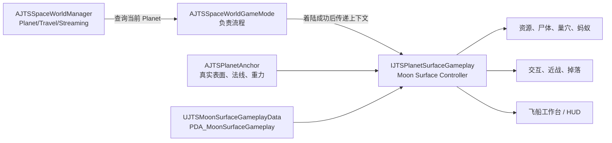

# SpaceWorld Moon 地表玩法迁移指南

> 目标：把旧月球原型关卡中的尸体、石头、矿脉、蚂蚁、攻击、拾取、飞船工作台购买等玩法，迁移到 `L_SpaceWorld` 中真实球体 Moon 的表面；保留可复用的规则，移除对 Fake Moon、平面 XY 坐标和固定 World-Z 的依赖。

## 当前实施状态（2026-09-11）

### 已完成的 C++ 实施

- [x] 建立 `IJTSPlanetSurfaceGameplay`、`FJTSSurfaceGameplayContext` 和每 Planet 的 Controller/Data Asset 映射；SpaceWorld 在玩家与飞船都完成着陆后才初始化地表玩法。
- [x] 新建 `UJTSMoonSurfaceGameplayData` 和 `IJTSMoonSurfaceGameplaySettings`；旧 `AJTSMoonGameMode` 继续实现同一设置接口，确保 `L_MoonPrototype_Tmp` 仍走 Legacy 路径。
- [x] 将资源生成、矿脉、普通掉落、尸体、巢穴、蚂蚁及蚂蚁尸体的真实 Moon 分支改为 `AJTSPlanetAnchor` 的表面查询、局部表面帧和球面弧长距离。
- [x] 将近战、交互、HUD 和飞船工作台的设置读取改为通用 Moon 设置接口；保留既有伤害、库存、扣料和装备事务，避免另写一套攻击或商店逻辑。
- [x] 真实 SpaceWorld 路径改为显式登记玩家、飞船和生成实体，不再把 Persistent Level 的所有 Actor 当作 Moon 内容；这避免未来多 Planet 共用 SpaceWorld 时串用交互对象。
- [x] 真实 Moon 分支会禁用 Fake Moon Wrap；旧原型图的 Fake Moon 分支仍保留。
- [x] 已以 `spaceEditor Win64 Development` 完成 C++ 编译和链接（不代表 Editor/PIE 验收已经完成）。

### 当前阻塞点：必须在 Unreal Editor 完成的配置

本仓库不直接修改二进制 `.uasset` / `.umap`，因此以下步骤必须由 Editor 完成。若没有可解析的 Moon Data Asset，新的保护逻辑会让 Moon Surface Gameplay 保持未 ready，而不会静默回退到 Fake Moon；尸体锚点或显式资源生成器缺失也会明确输出 Warning，必须在 PIE 验收前修复。

1. 在 Content Browser 创建 Data Asset：`Miscellaneous > Data Asset > JTSMoonSurfaceGameplayData`，建议命名为 `PDA_MoonSurfaceGameplay`，路径为 `Content/Space/Data/Planets/Moon/`。从 `BP_MoonGameMode` 逐项复制资源、蚂蚁、巢穴、工作台成本、掉落、攻击和食物/水数值，以及资源/蚂蚁 Blueprint 类。
2. 创建 `AJTSMoonSurfaceController` 的子 Blueprint，例如 `BP_MoonSurfaceController`；将它**放置在 `L_SpaceWorld` 的 Persistent Level**，`PlanetId` 设为 `Moon`。这使地图能够为实例配置尸体锚点，而不是在 C++ 中硬编码关卡 Actor。
3. 在真实 Moon 表面放置 `AJTSPlanetSurfaceAnchor`（可建子 Blueprint），设置 `PlanetAnchor` 为 Moon 的真实 `AJTSPlanetAnchor`、`PlanetId=Moon`、启用 `Snap On Begin Play` 和 `Align Rotation To Surface`；把它赋给 Controller 的 `CorpseSurfaceAnchor`。可选地设置 `MoonCorpseClass` 为项目的尸体 Blueprint。
4. 在同一 Persistent Level 放置 `AJTSMoonResourceSpawner`（或其子 Blueprint）；设置 `ResourceActorClass` 为真实 Moon 的资源 Blueprint，并把该实例赋给 Controller 的 `MoonResourceSpawner` 字段。Spawner 的位置决定球面生成区域中心方向，Data Asset 的 `SpawnRadius` 决定球面 cap 半径。真实 SpaceWorld 不再按名称扫描“第一个生成器”。
5. 打开 `BP_SpaceWorldGameMode`，在 `Surface Gameplay Controllers` 增加/填写 Moon 项：`PlanetId=Moon`、`ControllerClass=BP_MoonSurfaceController`、`GameplayData=PDA_MoonSurfaceGameplay`。确认 `L_SpaceWorld` 的 World Settings 使用该 GameMode。
6. 为资源、蚂蚁、巢穴和尸体使用项目自己的 Moon 子 Blueprint；真实 Moon 版本不得继续使用带 Fake Moon World Position Offset 的材质。C++ 会停用 Wrap 组件，但材质仍须在 Blueprint 中切到真实表面版本。

### 配置后的 PIE 验收顺序

1. 先只启用一具尸体和 3 个资源，确认 `PlanetAnchor` 表面 Trace、局部 Up、交互和一次伤害正确。
2. 再将 `MoonAntNestCount` 和 `MaxActiveMoonAntsPerNest` 暂设为 1，验证巢穴、漫游、受击、死亡和蚁尸掉落。
3. 最后测试飞船旁购买、资源不足、背包满、离开/返回 Moon，以及旧 `L_MoonPrototype_Tmp` 回归。
4. 发生初始化失败时，先在 Output Log 查找 `MoonSurfaceController`、`SpaceWorldGameMode`、`MoonResourceSpawner` 和 `PlanetAnchor` 的 Warning；优先修复第一个表面/配置错误，不要用旧 Fake Moon 作为兜底。

## 1. 结论与边界

不建议现在把整套月球玩法完全重写。

当前 C++ 已经有可复用的生命、近战、交互、背包/携带、掉落、飞船库存、工作台购买、资源开采和蚂蚁状态逻辑。完整重写会把已经存在的功能重新做一遍，并且最容易引入攻击重复扣血、购买扣料不一致、拾取丢失、旧关卡回归等风险。

应该重构的是下面三类“地表适配层”代码：

- 玩法初始化：旧 `AJTSMoonSurfaceController` 仅能从 `AJTSMoonGameMode`、`AJTSMoonWorldActor` 与 `UJTSMoonWrapSubsystem` 取得上下文，无法在 `AJTSSpaceWorldGameMode` 中自然启动。
- 球面坐标：资源、巢穴、蚂蚁、掉落仍有 XY 平面采样、`Dist2D`、固定 World-Z 向下射线、`FVector2D` 逻辑坐标等假月球假设。
- 表现与配置：若干 Actor 仍绑定 Fake Moon 材质、环绕组件或硬编码资源路径；具体资产和数值应移到 Blueprint/Data Asset 配置。

迁移采用“垂直切片、旧图保留”的方式：先在真实 Moon 成功放置一具尸体，再接入矿石与拾取、蚂蚁与战斗、最后接入工作台。`L_MoonPrototype_Tmp` 在迁移完成前始终保留，不能把它当作可直接拷贝到新地图的成品。

本次不直接编辑 `.uasset` 或 `.umap`；地图、Blueprint、Data Asset 的内容均通过 Unreal Editor 配置。

## 2. 已确认的项目现状

| 项目部分 | 现状 | 对迁移的意义 |
| --- | --- | --- |
| `Content/Space/Maps/L_MoonPrototype_Tmp.umap` | 旧月球原型仍在项目内，且体积明显大于当前 SpaceWorld 地图。 | 它是功能和配置的取样来源，不是直接迁移目标。 |
| `Content/Space/Maps/L_SpaceWorld.umap` | 目前已能让玩家和飞船按 `PlanetAnchor` 的真实表面着陆。 | 真实球面落地、径向重力和飞船停靠可以作为迁移基础。 |
| `AJTSPlanetAnchor` | 已提供真实网格表面查询、表面坐标系、球面随机点、弧长距离、径向重力相关能力。 | 所有地表生成/贴地/朝向应优先调用它。 |
| `AJTSMoonSurfaceController` | 已含月球资源、巢穴、食物/水、工作台购买等规则，但初始化依赖 Legacy Moon GameMode 和 Fake Moon。 | 保留规则主体，替换初始化和地表坐标依赖。 |
| `UJTSHealthComponent`、`UJTSMeleeComponent` | 已有生命和攻击命中路径；近战使用动画 Notify 并优先走 `ApplyDamage`。 | 不要另写一套伤害系统，只改可用性门槛与碰撞/表面适配。 |
| `AJTSMoonCorpseActor` | 已有 `SnapToPlanetSurfaceAnchor` 的真实表面放置路径。 | 尸体是最适合的首个垂直切片。 |
| `Content/ThirdParty/` | 其中有蚂蚁、岩石等源资产，但目录被 `.gitignore` 忽略。 | 必须先建立资产来源/备份策略，否则其他机器或 CI 无法复现。 |

迁移前的 SpaceWorld 运行日志已证明玩家、飞船和 Moon Landing Site 可以落到真实表面，但没有 Moon Surface Controller、资源生成或蚂蚁巢穴初始化记录。本文的 C++ 已补上该生命周期；由于对应 Data Asset/关卡实例尚未在 Editor 配置，仍不能把它视为 PIE 验收通过。

## 3. 目标架构



职责必须保持如下边界：

- `AJTSSpaceWorldManager`：只负责 SpaceWorld 状态、Planet 注册/查询、旅行与 Streaming；它不知道“Moon 有蚂蚁或商店”。
- `AJTSSpaceWorldGameMode`：在着陆成功、玩家和飞船都有效之后，找到当前 Planet 对应的地表玩法控制器并启动它。
- `AJTSPlanetAnchor`：唯一的真实表面、局部法线、重力方向、球面采样来源。
- `AJTSMoonSurfaceController`：Moon 专属玩法规则、运行时生成和清理；保留类名可降低旧 Blueprint 断链风险，但不再读取 `AJTSMoonGameMode` CDO 作为数据。
- Blueprint/Data Asset：选择 Moon 网格、资源/蚂蚁 Blueprint、材质、掉落类、数量、半径、工作台配方和关卡实例位置。

### 建议新增或调整的 C++ 边界

| 项目 | 目的 | 职责 | 依赖 |
| --- | --- | --- | --- |
| `IJTSPlanetSurfaceGameplay`（UInterface） | 让 SpaceWorld 按 Planet 启动玩法，而非硬编码 Moon 逻辑。 | `SupportsPlanet`、`InitializeSurfaceGameplay`、`ShutdownSurfaceGameplay`、`IsReady`。 | `AJTSPlanetAnchor`、玩家、飞船、配置数据。 |
| `FJTSSurfaceGameplayContext`（USTRUCT） | 用一个显式上下文替代从 GameMode/World 全局查找。 | 保存当前 Planet、玩家、飞船、Data Asset 和可选 Surface Level。 | 不拥有 Actor，不保存具体关卡硬引用。 |
| `UJTSMoonSurfaceGameplayData`（`UPrimaryDataAsset`） | 将旧 Moon GameMode 中的数值和资产选择移出流程类。 | 资源/巢穴生成规则、食物水规则、工作台配方和敌人类选择。 | 仅数据；当前类选择在 Data Asset/Blueprint 中配置，不在 C++ 硬编码项目资产。 |
| `AJTSMoonSurfaceController` 重构 | 保留既有业务规则，替换 Legacy 初始化。 | 消费 Context/Data Asset，生成/回收 Moon 内容，报告 ready 状态。 | Interface、PlanetAnchor、现有库存/交互系统。 |

不要一开始就创建泛化过度的“宇宙玩法大管理器”或把所有 Actor 合并成大类。若资源、蚂蚁、掉落三处都出现相同的贴地/朝向代码，再提取一个小的 `UJTSSurfacePlacementComponent`；否则优先直接复用 `AJTSPlanetAnchor` 的表面查询函数。

## 4. 保留、适配与重写范围

| 类别 | 现有实现 | 决策 | 具体动作 |
| --- | --- | --- | --- |
| 生命/受伤 | `UJTSHealthComponent` | 保留 | 继续使用 `ApplyDamage` 和既有死亡流程。 |
| 近战命中 | `UJTSMeleeComponent`、`JTSAnimNotify_AttackHit` | 保留主体，适配门槛 | 保留一次 Notify 对应一次命中的路径；把“Moon Controller 已就绪”的 Legacy 判断改为通用地表玩法 ready 状态。 |
| 交互/携带 | `IInteractable`、`UJTSInteractionComponent`、`UJTSCarryComponent` | 保留主体，适配查询 | 不再要求 Legacy Moon GameMode 才能寻找掉落物；使用当前地表玩法 Context。 |
| 资源矿脉 | `AJTSMoonResourceActor` | 适配 | 保留挖矿/产出/背包规则；替换 World-Z 贴地、Fake Moon 材质和环绕依赖。 |
| 资源散布 | `AJTSMoonResourceSpawner` | 必须重写地表部分 | 用球面 cap 采样、真实 Surface Hit、弧长间距替代 XY 随机和向下射线。 |
| 尸体 | `AJTSMoonCorpseActor` | 首先迁移 | 使用已有 `SnapToPlanetSurfaceAnchor`；先验证静态尸体，再接入蚂蚁尸体掉落。 |
| 世界掉落 | `AJTSWorldPickupActor` | 适配 | 初始点、弹出方向、落点追踪改为局部法线/切平面；禁止把 Z 清零。 |
| 蚂蚁巢穴 | `AJTSMoonAntNestActor` | 重写位置生成部分 | 巢穴和出生点使用 PlanetAnchor 的球面采样、表面帧和弧长间距。 |
| 蚂蚁行为 | `AJTSMoonAntActor` | 较大适配 | 可保留生命、状态和攻击意图；删除/替换 `FVector2D`、`Dist2D`、Wrap Delta、Z 埋地/起身。 |
| 蚂蚁尸体拾取 | `AJTSMoonAntCorpsePickupActor` | 适配 | 弹出和朝向按局部法线/切线进行；必要时第一阶段直接复用普通世界掉落。 |
| 工作台购买 | `AJTSMoonSurfaceController::TryBuyWorkshopEquipment`、HUD | 保留主体，迁移配方 | 保留资源扣除和飞船邻近校验；价格、物品类、显示名转入 Data Asset。 |
| Fake Moon 系统 | `AJTSMoonWorldActor`、`UJTSMoonWrapSubsystem`、`UJTSMoonWrappedActorComponent` | 暂时保留，后续退役 | 仅服务旧原型地图；真实 Moon 路径不能再依赖它们。 |

## 5. 成熟做法如何映射到本项目

### 配置与资产引用

Unreal 的 Data Asset/Primary Data Asset 适合承载一个系统的配置；Primary Data Asset 还可配合 Asset Manager 和软引用按需加载资产。因此 Moon 的数值、资源/敌人类、材质和工作台配方应从 `AJTSMoonGameMode` 移到 `PDA_MoonSurfaceGameplay`，而不是继续把 GameMode 当配置仓库。参考 Epic 的 [Data Assets](https://dev.epicgames.com/documentation/en-us/unreal-engine/data-assets-in-unreal-engine) 和 [Asset Management](https://dev.epicgames.com/documentation/en-us/unreal-engine/asset-management-in-unreal-engine) 文档。

推荐内容路径：

```text
Content/Space/Data/Planets/Moon/PDA_MoonSurfaceGameplay
Content/Space/Blueprints/Planets/Moon/BP_MoonSurfaceController
Content/Space/Blueprints/Planets/Moon/BP_MoonResourceActor
Content/Space/Blueprints/Planets/Moon/BP_MoonAnt
Content/Space/Blueprints/Planets/Moon/BP_MoonSurfaceAnchor_*
```

对 `ThirdParty` 中的蚂蚁和岩石，建议在 `Content/Space/Blueprints/Planets/Moon/` 创建项目自己的子 Blueprint 或包装 Blueprint；不要直接在第三方原资产上持续改业务逻辑。

### 静态装饰与可交互实体分开

静态小石头、纯装饰晶体可以在后期由 PCG 或 Instanced Static Mesh 生成；可被攻击、采集、保存、掉落或联网复制的矿脉/尸体/敌人仍应由权威运行时生成器管理。PCG 支持编辑器和运行时工作流，但不应在第一阶段承担交互物状态保存。参考 Epic 的 [PCG Framework](https://dev.epicgames.com/documentation/en-us/unreal-engine/procedural-content-generation-framework-in-unreal-engine)。

### World Partition 与 Data Layers

不要为了本次迁移而把 `L_SpaceWorld` 强制改成 World Partition。当前优先在既有持续 SpaceWorld 中完成一个 Moon 表面区域。若未来 Moon 面积、团队人数或装饰密度显著增长，再在地图副本上评估 World Partition、Data Layers、OFPA 和 HLOD；这是内容流送方案，不是球面玩法适配方案。参考 [World Partition](https://dev.epicgames.com/documentation/en-us/unreal-engine/world-partition-in-unreal-engine) 与 [Runtime Data Layers](https://dev.epicgames.com/documentation/en-us/unreal-engine/world-partition---data-layers-in-unreal-engine)。

### GAS、StateTree、导航的取舍

当前不建议为了一个近战攻击、生命值和工作台购买立刻引入 GAS。现有 `UJTSHealthComponent` + `UJTSMeleeComponent` 已覆盖当前范围；GAS 在多技能、Buff/Debuff、预测联机、复杂冷却与属性结算成为明确需求时才值得迁移。参考 [Gameplay Ability System](https://dev.epicgames.com/documentation/en-us/unreal-engine/gameplay-ability-system-for-unreal-engine)。

蚂蚁第一阶段也不需要马上接入 StateTree 或 NavMesh：先实现沿球面切向移动、每步投射回真实表面即可。若要大量蚂蚁追逐、绕障、联机同步，再单独做“自定义重力 + NavMesh”验证关卡；导航是碰撞驱动的，不能假定传统平面 NavMesh 在任意球面都正确。StateTree 可作为行为复杂化后的选择，参考 [StateTree Overview](https://dev.epicgames.com/documentation/en-us/unreal-engine/overview-of-state-tree-in-unreal-engine)。

## 6. 迁移前的准备工作

### 6.1 冻结可回归基线

1. 在版本控制中提交或暂存当前工作区，确保迁移可回退。
2. 保留 `L_MoonPrototype_Tmp`、其 Moon GameMode Blueprint 和现有 Fake Moon 资源；不要删除或原地改造成 SpaceWorld 版本。
3. 在 Unreal Editor 中打开旧图，记录下列内容到任务单：World Outliner 中的控制器、资源生成器、尸体、巢穴、飞船、地表锚点，及其每个关键参数。
4. 对旧图的 Moon GameMode Blueprint 使用 Reference Viewer，列出资源类、蚂蚁类、掉落类、工作台 UI、材质与音效的依赖。
5. 检查 `Content/ThirdParty/` 的来源。由于该目录当前被忽略，至少选择一种可复现方式：将允许提交的项目副本移入 `Content/Space/`、使用 Git LFS、或在仓库中提供合法的导入说明与版本清单。

### 6.2 建立迁移清单

按“功能而不是 Actor 数量”登记以下项目，并记录旧图参数、目标 Blueprint、验收方式：

- 场景尸体：静态尸体、可交互尸体、蚂蚁死亡后的尸体分别记录。
- 石头：纯装饰石头和可开采石头分开记录。
- 矿脉：资源类型、生命值、掉落、刷新、最小间距、生成区域。
- 蚂蚁：巢穴位置、出生数量、漫游半径、仇恨/攻击条件、死亡掉落。
- 人物攻击：攻击输入、蒙太奇、Notify、碰撞通道、伤害值、冷却。
- 飞船工作台：开启条件、距离限制、配方、扣料、生成/装备物品、UI 状态。
- 生命周期：初次着陆、离开 Moon、返回 Moon、读档后的生成/去重行为。

不要使用“右键 Migrate 整张旧地图”作为主要方案：它会一起带入 Fake Moon、旧关卡实例和无用依赖，且无法解决坐标系问题。

## 7. 分阶段实施步骤

每个阶段都应独立提交、独立可玩。未通过本阶段验收，不进入下一阶段。

### 阶段 1：确认真实 Moon 表面是唯一物理来源

**C++ 不新增玩法功能。**

Editor 操作：

1. 打开 `L_SpaceWorld`，选中 Moon 的 `AJTSPlanetAnchor`/对应 Planet Blueprint。
2. 设置 `PlanetId` 为 `Moon`，并将 `GameplaySurfaceActor`、`GameplaySurfaceComponent` 指向 Moon 的真实可见网格或其专用碰撞网格；不要指向 Fake Moon 地面。
3. 确保该表面可被查询：碰撞已启用，至少能被项目地表查询使用的 Trace Channel 阻挡。必要时用 `Visibility` 作为统一查询通道，并在项目碰撞设置中记录该约定。
4. 核对 Planet Center 与球体真实中心一致；半径、着陆点和飞船停靠点都落在同一个球面定义上。
5. 使用现有 `BP_JTSPlanetArrivalAnchor` / Landing Site 配置一个 Moon 落点，运行 PIE。

验收：

- 玩家和飞船落在可见 Moon 网格上，而不是悬空、陷入或贴在旧平面。
- 玩家移动时重力朝 Moon Center，角色脚底局部 Up 与表面法线一致。
- 在赤道、斜坡和接近极区各测一个点，`AJTSPlanetAnchor::TraceToSurface`/`GetSurfaceFrameAt` 均能返回有效结果。

失败时先修表面碰撞和 Planet Center，不要开始迁移资源或敌人。

### 阶段 2：建立 SpaceWorld 地表玩法生命周期

**新增系统说明。**

- 目的：让任意 Planet 在着陆成功后启动自己的地表玩法。
- 职责：GameMode 编排生命周期；Controller 执行 Moon 规则；PlanetAnchor 提供空间语义。
- 依赖：当前 Planet、已落地玩家、已停靠飞船、`UJTSMoonSurfaceGameplayData`。

C++ 改动：

1. 新建 `IJTSPlanetSurfaceGameplay` 和 `FJTSSurfaceGameplayContext`。接口至少提供 Planet 匹配、初始化、关闭和 ready 查询。
2. 新建 `UJTSMoonSurfaceGameplayData : UPrimaryDataAsset`。迁移旧 `AJTSMoonGameMode` 的资源数、巢穴数、掉落、食物水配置、工作台配方和 Blueprint 类选择；不要迁移具体关卡 Actor 引用。
3. 保留 `AJTSMoonSurfaceController` 类名，并让它实现上述接口。把 `GetMoonSettings()`、从 Moon GameMode CDO 取设置、等待 `MoonWorld`/`MoonWrap` 的路径替换为显式 Context/Data Asset。
4. 在 `AJTSSpaceWorldGameMode` 中，在着陆真正完成的事件点创建 Context 并初始化控制器。若现有 Landing Manager 没有完成事件，新增一个只表达“初始着陆已完成”的 delegate；不要用每 0.1 秒重试来猜测状态。
5. 只有 Controller 初始化成功后才设置地表玩法 ready / `MoonExploration` 可交互状态。初始化失败时应记录明确原因，并保持输入/UI 不进入可交互 Moon 状态。
6. `AJTSSpaceWorldManager` 继续只管理 Planet/Travel/Streaming；不要向它加入 Moon 资源、商店或蚂蚁字段。

Editor 操作：

1. 创建 `PDA_MoonSurfaceGameplay`，把旧 GameMode Blueprint 中的数值和类逐项复制进去。
2. 创建或调整 `BP_MoonSurfaceController`，配置其支持 PlanetId 为 `Moon`，并引用该 Data Asset。
3. 在 `BP_SpaceWorldGameMode` 中配置 Controller 类/实例入口，不在 C++ 中写死 Blueprint 路径。

验收：

- 从 Earth 进入 SpaceWorld 后，着陆完成只初始化一次 Moon Controller。
- 重启 PIE、重新着陆、离开再返回时不会重复产生同一批资源/巢穴。
- 旧 `L_MoonPrototype_Tmp` 仍可以通过它原有 GameMode 运行。

### 阶段 3：尸体垂直切片

这是第一个真正的玩法迁移，规模最小、定位问题最快。

Editor 操作：

1. 在 Moon 表面放置一个 `AJTSPlanetSurfaceAnchor` 或其子 Blueprint，命名为例如 `MoonCorpseAnchor_A`。
2. 在放置于 `L_SpaceWorld` 的 `BP_MoonSurfaceController` 实例中配置 `CorpseSurfaceAnchor` 和 `MoonCorpseClass`；锚点是关卡实例，不能放入 `PDA_MoonSurfaceGameplay`。
3. 通过 Controller 在初始化后生成一具 `AJTSMoonCorpseActor`，调用已有的 `SnapToPlanetSurfaceAnchor` 真实表面路径。

C++ 注意：

- 真实 Moon 分支必须禁用 Fake Moon 展示/环绕逻辑，不要同时保留两套位置更新。
- 尸体的 Up 应取 Surface Hit Normal 或由 `AJTSPlanetAnchor::MakeSurfaceAlignedRotation` 生成，不能固定 `FVector::UpVector`。

验收：

- 尸体紧贴真实 Moon 表面，换到不同纬度不会侧倒或飘离。
- 玩家可以靠近、交互或触发后续预期行为。
- 不加载 `AJTSMoonWorldActor`/`UJTSMoonWrapSubsystem` 仍可工作。

### 阶段 4：矿石、矿脉、拾取与掉落

**C++ 改动顺序。**

1. 重写 `AJTSMoonResourceSpawner` 的候选点生成：使用 `AJTSPlanetAnchor::RandomPointInSurfaceCap` 获取真实 Surface Hit，不再构造 XY 点后向 World-Z 射线。
2. 用 `ApproximateSurfaceArcDistance` 或球面夹角做资源间距判断；禁止用 `Dist2D` 作为球面距离。
3. 对每个资源将 Location、Rotation、Normal 都从 Surface Hit/Surface Frame 初始化。资源 Actor 需要贴地时调用 PlanetAnchor，不再使用 `AdjustToGround` 中的固定 Z 逻辑。
4. 修改 `AJTSWorldPickupActor`：掉落初始方向应由“局部法线 + 切平面随机方向”构成，落点应沿当前 Planet 的重力方向探测。不能执行 `Direction.Z = 0`，也不能绕 `FVector::UpVector` 随机旋转。
5. 保留现有挖矿、资源入背包、飞船库存、容量溢出与普通交互规则；把所需类和数值从 Data Asset 读取。
6. 给随机生成加入稳定 Seed、最大尝试次数和生成日志。Seed 应来自 Moon 配置/存档，而不是每次随机时间，保证读档和联调可复现。

Editor 操作：

1. 在 `PDA_MoonSurfaceGameplay` 的 `Moon|Resources` 配置数量、`SpawnRadius`、`MinimumResourceSpacing`、权重、收益和地标排除距离；`SpawnRadius` 和间距都按球面弧长解释。保持 `Use Deterministic Seed=true`，并填写稳定的 `RandomSeed`，以便重复进入和联调可复现。
2. 在 `AJTSMoonResourceSpawner` 实例/子 Blueprint 配置 `ResourceActorClass` 和地表 Probe 值。Spawner 自己的 Transform 是生成区域中心方向；运行时数量、半径、间距和 Seed 由 Data Asset 覆盖。
3. 先把数量降为 3 个确定性矿脉作为验收样本；动态散布成功后再恢复批量数量。
4. 检查矿脉、玩家攻击碰撞、交互 Trace 使用的 Collision Profile/Channel 是否一致。

验收：

- 三个不同纬度的矿脉都贴在真实表面，朝向正确。
- 用镐攻击一次只结算一次，矿脉生命与掉落正确。
- 拾取后资源进入背包/飞船库存；背包满时掉落物会在局部表面附近落下并可重新拾取。
- 重新进入 Moon 时不会无控制地重复散布，存档策略符合设计。

### 阶段 5：巢穴、蚂蚁与蚂蚁尸体

**先迁移生成和贴地，再迁移移动。**

1. 改造 `AJTSMoonAntNestActor`：巢穴位置和蚂蚁出生点由球面 cap/局部切线采样取得；出生点回投真实表面并按 Surface Frame 对齐。
2. 改造 `AJTSMoonAntActor`：将 `FVector2D` 目标、XY Wrap Delta、`Dist2D` 和固定 Z 埋地/起身替换为三维世界点、球面弧长和局部表面帧。
3. 简单漫游可采用“沿切平面移动一小段 -> 沿重力方向投射回真实表面 -> 更新局部朝向”的循环。保留现有生命、受伤、死亡和简单状态机，不要同时重写 AI 架构。
4. 如果资源、蚂蚁、掉落中已经重复出现相同的投射/朝向代码，此时再提取小的 `UJTSSurfacePlacementComponent`。它只负责接收 PlanetAnchor、贴地、对齐、局部切线方向，不负责 AI 或业务规则。
5. 改造 `AJTSMoonAntCorpsePickupActor` 的死亡弹出：使用局部法线和切向随机方向；若这一项阻塞主流程，第一阶段让蚂蚁死亡直接生成已适配的 `AJTSWorldPickupActor`，后续再恢复专用表现。

验收：

- 巢穴、蚂蚁、蚂蚁尸体都不依赖 Fake Moon Wrap。
- 蚂蚁能在三个不同区域生成、漫游、受击、死亡、掉落，不会穿出表面或因纬度变化侧翻。
- 同一死亡事件只生成一次尸体/掉落。
- 先以少量蚂蚁验证；性能稳定后再提高巢穴和数量。

### 阶段 6：人物攻击和交互判定

C++ 改动：

1. 在 `UJTSMeleeComponent` 中将 Legacy `FindMoonSurfaceController`/Moon GameMode 可用性判断改为当前 `IJTSPlanetSurfaceGameplay::IsReady` 或 Context 查询。
2. 保留现有的命中顺序：动画 Notify 触发攻击窗口，优先向 `UJTSHealthComponent` 发送 `ApplyDamage`；仅在目标没有 Health Component 时才使用 `IJTSMeleeTarget` 后备路径。
3. 在 `UJTSInteractionComponent` 中改掉“必须找到 Legacy Moon Controller 才能发现世界掉落”的条件，改为检查当前 Planet 地表玩法已启动且对象属于当前 Context。
4. 为蚂蚁、矿脉、尸体、掉落分别明确 Collision Object Type 与 Trace Channel。攻击 Sweep、交互 Trace、地表 Probe 不应共享一个含义模糊的碰撞通道。

Editor 操作：

1. 检查攻击蒙太奇中 `JTSAnimNotify_AttackHit` 仍存在且仅在预期帧出现一次。
2. 检查蚂蚁 Hit Collider、矿脉碰撞和可交互组件的 Query 设置；不要因 Block 地表而意外 Block 玩家移动。
3. 在 Moon 赤道、斜坡、极区分别测试第三人称镜头朝向下的攻击 Sweep。

验收：

- 同一攻击 Notify 对同一目标只造成一次伤害。
- 攻击矿脉、蚂蚁与拾取尸体的距离/朝向一致，不因世界朝向变化失效。
- 未完成着陆或 Controller 未 ready 时，攻击和交互不会进入半初始化状态。

### 阶段 7：飞船工作台购买

这里的“商店”实际是当前飞船附近的工作台购买流程，应保留其游戏语义。

C++ 改动：

1. 将现有镐、背包、刀、斧的资源成本从旧 Moon GameMode 转入 `UJTSMoonSurfaceGameplayData`。当前装备仍由既有 `EJTSEquipmentType` / Player Equipment Component 装备，不额外引入一套物品实例系统。
2. 保留 `TryBuyWorkshopEquipment` 的原子顺序：验证当前玩法/距离/资源/装备条件 -> 消耗资源 -> 生成或装备物品 -> 刷新 UI。
3. UI 从当前 Surface Gameplay Context 获取可购买条目，不从某个旧关卡 Actor 取数据。
4. 若将来支持联机，购买与资源扣除必须在服务端执行，UI 只请求操作；本阶段至少不要在客户端 Blueprint 再扣一次资源。

Editor 操作：

1. 在 `PDA_MoonSurfaceGameplay` 中配置镐、背包、刀、斧等现有条目的成本。
2. 在 `BP_SpacecraftActor`/对应工作台交互点确认 UI 入口仍连接现有 HUD。
3. 在 SpaceWorld Moon 上测试飞船旁、飞船外远处、背包满、资源不足四种情形。

验收：

- 靠近飞船才能打开和购买；离开范围会正确关闭或拒绝。
- 资源只扣一次，购买成功后物品只生成/装备一次。
- HUD 的资源数量、按钮可用状态与背包/飞船库存一致。

### 阶段 8：进入、离开、读档与清理（待后续实现）

这是容易被忽略但决定迁移是否可靠的阶段。

1. 为 `AJTSMoonSurfaceController` 定义明确生命周期：`Uninitialized -> Initializing -> Ready -> ShuttingDown`。任何生成前先检查状态，避免多次着陆回调重复创建 Actor。
2. 设计动态实体策略：哪些矿脉/尸体/蚂蚁在离开 Moon 时销毁，哪些写入旅行数据/存档，哪些以确定性 Seed 重新生成。
3. 清理 Controller 持有的 Timer、弱引用、生成 Actor 列表和 UI 状态；不要让旧的 0.1 秒初始化重试计时器留在 SpaceWorld。
4. 保留 Legacy Map 的 Fake Moon 初始化路径，直到 SpaceWorld 回归测试稳定后再单独清理。

验收：

- 连续进入/离开 Moon 三次没有重复资源、重复巢穴、残留 UI 或无效 Timer。
- 保存后重载时，已采集资源、已购买装备、已死亡敌人的行为符合选定的存档规则。
- 打开旧月球原型图仍不受 SpaceWorld 改动影响。

### 阶段 9：性能与遗留清理

1. 先在少量资源、少量巢穴条件下做功能验收，再逐步恢复旧图的密度。
2. 使用 Unreal Insights 或 `stat unit`、`stat game`、`stat gpu` 检查资源/蚂蚁数量增加后的 Game Thread、渲染与内存。避免为每颗装饰石头创建 Tick Actor。
3. 静态石头改为 Instanced Static Mesh/PCG 是后续优化项；可交互矿脉和敌人保持独立运行时实体。
4. 当旧图和 Fake Moon 依赖已连续完成两轮回归后，使用 Reference Viewer 确认没有引用，再以独立变更废弃/删除 `AJTSMoonWorldActor`、Wrap Subsystem 和相关 Legacy 分支。不要在功能迁移的同一提交中删除它们。

## 8. 球面实现准则

以下准则是本次迁移的硬性约束：

| 旧假设 | 新做法 |
| --- | --- |
| `FVector2D` 逻辑位置 | 使用真实 World 位置或 PlanetAnchor 的表面点。 |
| `Dist2D` | 使用球面夹角、弧长或 `ApproximateSurfaceArcDistance`。 |
| `Location.Z` 调整高度 | 使用 Surface Hit 的 Location/Normal，沿 Planet 重力方向 Probe。 |
| `FVector::UpVector` | 使用局部表面 Normal/Surface Frame 的 Up。 |
| `Direction.Z = 0` | 将方向投影到局部切平面。 |
| 绕 `FVector::UpVector` 旋转 | 绕局部 Surface Normal 旋转。 |
| 固定 World-Z 向下射线 | 从候选点沿“指向 Planet Center”的局部重力方向射线。 |
| Fake Moon Wrap Delta | 三维世界差值配合球面弧长；需要绕行时由表面坐标/路径策略处理。 |

`AJTSPlanetAnchor` 已经提供 `TraceToSurface`、`ProjectPointToSurface`、`ProbeSurfaceAlongGravity`、`GetSurfaceFrameAt`、`RandomPointInSurfaceCap`、`ApproximateSurfaceArcDistance` 等能力。新代码应优先调用它们，而不是在各 Actor 内重新计算球体交点。

角色当前已使用自定义重力方向。扩展敌人移动时要遵循相同原则；UE 的 `UCharacterMovementComponent::SetGravityDirection` 也要求网络端正确同步重力方向，参考 [SetGravityDirection API](https://dev.epicgames.com/documentation/en-us/unreal-engine/API/Runtime/Engine/UCharacterMovementComponent/SetGravityDirection)。

## 9. 风险、问题与处理方式

| 风险 | 触发信号 | 处理方式 |
| --- | --- | --- |
| Moon 网格没有可查询碰撞 | 表面 Probe 失败、实体悬空/陷入 | 先修 `GameplaySurfaceComponent` 与 Collision Profile；不要用平面作临时兜底。 |
| Legacy 初始化悄悄返回空 | SpaceWorld 只有玩家/飞船，没资源/巢穴 | 用显式着陆完成事件和 Context；初始化失败必须打印原因。 |
| 资源或蚂蚁重复生成 | 回到 Moon 后数量翻倍 | Controller 生命周期状态、Spawn Registry、Seed/存档策略和清理路径一起设计。 |
| Fake Moon 与真实 Moon 双重更新 | Actor 抖动、飞走、旋转冲突 | 真实 Moon 分支中禁用 Wrap/Legacy 展示组件，只保留一种位置所有权。 |
| 攻击重复伤害 | 一刀掉两次血 | 只保留 Health Component 优先路径；用 Notify/目标去重做测试。 |
| 掉落物在球面上飞向错误方向 | 极区掉落横飞或穿地 | 用局部法线/切平面生成初速度并沿局部重力探测。 |
| 第三方资产无法复现 | 换电脑、CI 或打包后缺蚂蚁/岩石 | 解决 `Content/ThirdParty` 忽略策略，记录许可证、来源和版本。 |
| 过早引入 PCG/GAS/NavMesh | 迁移范围膨胀、调试困难 | 第一阶段只复用现有系统；这些能力各自做独立验证/提案。 |
| 多人编辑关卡冲突 | `.umap` 频繁二进制冲突 | 本轮先减少改图范围；大规模内容阶段再评估 OFPA/World Partition。 |

## 10. 何时才应该完整重写

仅在以下情况之一成立时，才把某个子系统改为“替换实现”，而不是继续适配：

- 旧 Blueprint 中存在无法迁出的、大量未记录的核心业务图，且 Reference Viewer/试玩证明 C++ 并非真实功能来源。
- 删除 Fake Moon 依赖后，一个类的主体几乎只剩 XY/Wrap/Z 处理，原有状态与业务规则已无法独立保留。
- 需要大规模、多层级、可预测联机的技能/属性系统，现有 Health + Melee 组件已无法满足明确的产品需求。
- 需要复杂群体寻路和动态绕障，经过独立球面导航验证后确认简单切向移动不可用。

即使发生以上情况，也应按子系统替换：例如只重写 `AJTSMoonAntActor` 的移动组件，而不是重写资源、购买、背包和攻击整套链路。

## 11. 最小验收矩阵

| 场景 | 通过标准 |
| --- | --- |
| 初次进入 SpaceWorld Moon | 玩家、飞船正确落地；Controller 只 ready 一次。 |
| 表面重力 | 赤道、斜坡、极区均向 Moon Center 重力，角色/实体局部 Up 正确。 |
| 场景尸体 | 贴地、可交互、不依赖 Fake Moon。 |
| 石头/矿脉 | 贴地、可挖、资源结算一次、掉落可拾取。 |
| 蚂蚁/巢穴 | 生成、移动、受击、死亡、掉落均在真实表面正常。 |
| 人物攻击 | 单次 Notify 单次伤害；不同纬度判定一致。 |
| 飞船工作台 | 距离限制、资源扣除、物品生成/装备、HUD 刷新正确。 |
| 离开并返回 | 无重复生成、无残留 Timer/UI，状态符合存档规则。 |
| 旧月球原型图 | 仍能通过旧 GameMode 运行，作为回归基线。 |

## 12. 推荐执行顺序与提交粒度

建议按下列顺序提交，便于定位回归：

1. `chore`: 资产来源清单、旧图参数记录、Moon 表面碰撞校验。
2. `refactor`: Surface Gameplay Interface、Context、Primary Data Asset，SpaceWorld 生命周期接入；不改变资源/敌人表现。
3. `feat`: SpaceWorld Moon 静态尸体垂直切片。
4. `feat`: 矿脉/掉落/拾取的球面适配。
5. `feat`: 巢穴、蚂蚁、蚂蚁尸体的球面适配。
6. `refactor`: 攻击/交互门槛迁移，工作台配方数据化。
7. `test`: 进入/离开/读档/旧图回归与性能基线。
8. `cleanup`: 仅在独立变更中废弃 Fake Moon 路径。

每次涉及 C++ 的提交，关闭 Unreal Editor（避免 Live Coding 干扰）后使用项目现有 Editor Build 配置编译，例如：

```powershell
D:\Software\UE_5.8\Engine\Build\BatchFiles\Build.bat spaceEditor Win64 Development D:\projects\space\space.uproject -WaitMutex -NoHotReloadFromID
```

如果编译失败，先修复第一个有效错误；不要通过修改无关文件绕过问题。每个阶段完成后都要在 PIE 和旧月球原型图各做一次回归。

## 13. 本轮交付后的检查清单

- [x] 已定义着陆完成到 Surface Controller 初始化的单一事件链。
- [x] 已完成尸体、资源/掉落、巢穴/蚂蚁/蚁尸的 C++ 球面适配。
- [x] 已将攻击、交互和工作台设置读取迁移到通用设置接口。
- [x] 已完成 Development Editor 编译。
- [ ] 已在 Editor 中记录旧图的实际 Actor/Blueprint 参数和引用，并复制到 `PDA_MoonSurfaceGameplay`。
- [ ] 已确认 Moon 的真实可查询表面、中心和 Landing Site。
- [ ] 已在 `L_SpaceWorld` 放置 Controller、尸体表面锚点和资源生成器，并把生成器显式赋给 Controller。
- [ ] 已决定第三方资产的版本控制/导入方案。
- [ ] 已完成 PIE：尸体 -> 3 个资源 -> 1 个巢穴/蚂蚁 -> 工作台 -> 离开/返回 -> 旧图回归。

接下来应按本文“当前阻塞点：必须在 Unreal Editor 完成的配置”逐项配置并验收，而不是把旧图中的所有 Actor 复制到 `L_SpaceWorld`。
